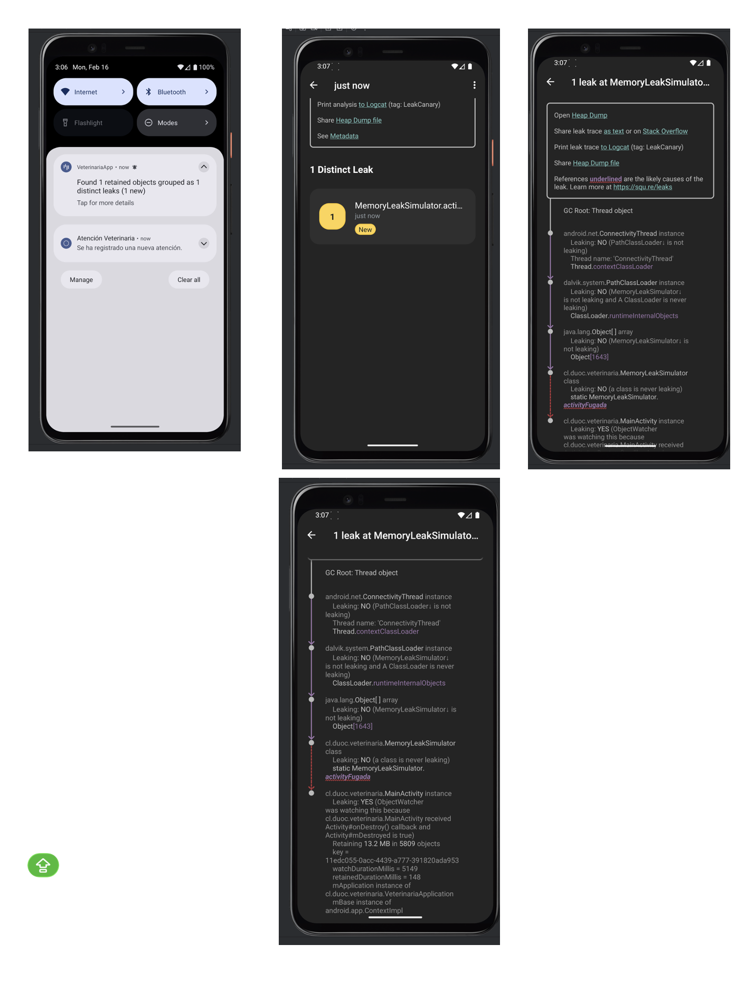
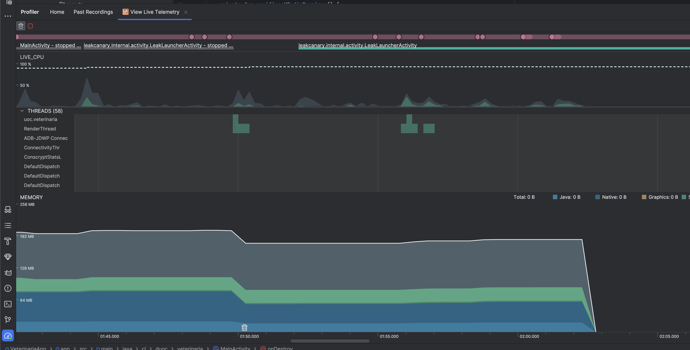
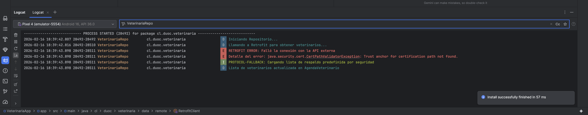
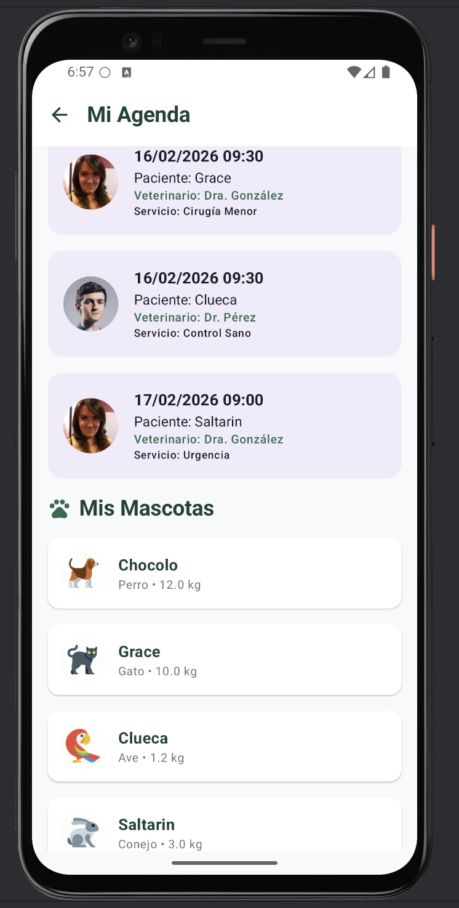

# Semana 6: Integrando librerías externas para ampliar funcionalidades móviles

## 📝 Descripción de la Actividad
Este proyecto corresponde a la fase de potenciación de la **VeterinariaApp**, donde se han implementado técnicas avanzadas de desarrollo Android. El objetivo principal ha sido mejorar la conectividad, el rendimiento y la calidad del código mediante la integración de librerías externas, gestión de procesos en segundo plano y diagnóstico de memoria.

---

## 🛠️ Tecnologías e Implementaciones Técnicas

### 1. Procesos en Segundo Plano (Asincronía)
Se seleccionó el flujo de **Registro de Consultas y Sincronización de Especialistas**. Para garantizar una experiencia fluida:
*   **Kotlin Coroutines:** Se utilizan para realizar peticiones de red y operaciones de base de datos (Room) fuera del hilo principal (Main Thread), evitando el bloqueo de la interfaz.
*   **Justificación:** El uso de Corrutinas permite escribir código asíncrono de forma secuencial y legible, optimizando el consumo de recursos.

### 2. Integración de Librerías Externas (Paso 6)
*   **Retrofit (API REST):** Utilizada para obtener la lista de médicos veterinarios desde un servidor externo.
    *   *Justificación Técnica:* Provee una gestión tipada de las respuestas JSON y se integra nativamente con Corrutinas, lo que facilita el manejo de errores de red.
*   **Coil (Carga de Imágenes):** Implementada para renderizar las fotografías de los especialistas y avatares de mascotas.
    *   *Justificación Técnica:* Es una librería liviana optimizada para Jetpack Compose que gestiona automáticamente el caché y el redimensionamiento de imágenes.
*   **LeakCanary (Diagnóstico):** Herramienta esencial para la detección de fugas de memoria.
    *   *Justificación Técnica:* Permite identificar objetos que no están siendo recolectados por el Garbage Collector, asegurando que la app no consuma memoria innecesaria en sesiones prolongadas.

### 3. Debugging y Gestión de Errores (Paso 3)
*   **Resiliencia:** Se implementaron bloques `try-catch` en el repositorio para manejar excepciones de red.
*   **Logcat:** Registro de errores críticos para facilitar el mantenimiento.
*   **Modo Respaldo:** La app cuenta con una lista de especialistas local en caso de que la API remota no esté disponible.

### 4. Diagnóstico de Memory Leaks (Paso 4 y 5)
Se utilizó **LeakCanary** para diagnosticar la gestión de memoria. 
*   **Escenario Detectado:** Se identificó una fuga real provocada por una referencia estática a la `MainActivity` (Simulador de Fuga).
*   **Corrección:** Se eliminaron las referencias estáticas y se aseguró la liberación de recursos (como los receivers de conectividad) en el método `onDestroy()`.

---

## 🏗️ Arquitectura: MVVM
El proyecto aplica una separación estricta de responsabilidades:
1.  **Model:** Entidades de Room y modelos de datos de Retrofit.
2.  **View:** Pantallas desarrolladas 100% en **Jetpack Compose**.
3.  **ViewModel:** Lógica de negocio y gestión de estado mediante `StateFlow`.
4.  **Repository:** Capa intermedia que decide si los datos provienen de la API o de la base de datos local.

---

## 📸 Evidencias de Funcionamiento y Diagnóstico

### 1. Diagnóstico de Memoria (LeakCanary)
Se observa la traza de la fuga detectada y su posterior corrección (0 leaks).

### 2. Monitoreo de Rendimiento (Android Profiler)
Validación del consumo de CPU y RAM durante la carga asíncrona de especialistas.

### 3. Debugging y Resiliencia (Logcat)
Captura que demuestra la interceptación de errores de red y el protocolo de respaldo (Fallback).

### 4. Interfaz de Usuario y Librería Coil
Renderizado de imágenes dinámicas desde API REST utilizando Coil.

---

## 📁 Entregables Adicionales
*   **📦 Archivo APK:** [Descargar app-debug.apk](app-debug.apk) (Ubicado en la raíz del repositorio).
*   **📄 Informe Técnico:** [Ver Informe PDF](Documentacion/Informe_Tecnico_Liliana_Tapia.pdf).
*   **🖼️ Capturas de Pantalla:** Ubicadas en la carpeta `/screenshots`.

---
**Desarrollado por:** Liliana Tapia  
**Asignatura:** Desarrollo de Aplicaciones Móviles II  
**Institución:** DUOC UC
